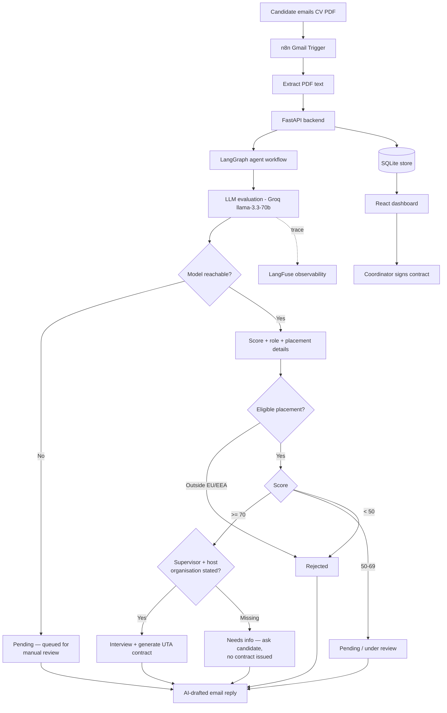

<div align="center">

# 🤖 Agentic Internship Coordinator

**An AI-powered internship-application screening system** — it reads a candidate's CV, evaluates it with an LLM agent workflow, decides interview / needs-info / pending / reject, drafts a personalised email, and generates an official university internship agreement for the coordinator to sign.

Built for real use at the university (UTA – Akademia Techniczno-Artystyczna w Warszawie).


</div>

---

## ✨ What it does

A candidate emails their CV → the system evaluates it end-to-end and replies automatically, while a recruiter dashboard gives full visibility and a one-click signing flow.

- 📄 **PDF CV ingestion** — via email (n8n Gmail trigger) or direct API/dashboard upload
- 🧠 **LLM agent evaluation** — LangGraph workflow scores 0–100, extracts strengths/weaknesses, recommends the best-fit internship role
- ✉️ **Personalised emails** — AI-drafted interview / clarification-request / under-review / rejection messages (with safe static-template fallback)
- 🔒 **Mandatory-field gate** — an agreement names a host organisation and a workplace supervisor, so an application that omits them is held at **`request_clarification`** and the candidate is asked for exactly what is missing. An incomplete application can never reach contract generation — and is never rejected for an omission it can fix
- 🧯 **Degrades safely** — if the model is unreachable (outage, spent token quota) the application is queued for manual review rather than judged by the keyword fallback, so infrastructure trouble never turns into a rejection email
- 📝 **Official contract generation** — produces the UTA *Appendix No. 3* internship agreement, signed electronically in the dashboard (canvas signature pad → embedded in the PDF)
- 📊 **Recruiter dashboard** — React UI with live candidate inbox, evaluation detail, and contract signing
- 🔭 **LLM observability** — every model call traced in LangFuse (latency, tokens, prompt, output)
- 🛡️ **Prompt-injection hardened** — evaluated against a 10-technique red-team set (see [Security](#️-security--robustness))
- 💾 **Persistent** — applications stored in SQLite, survive restarts

---

## 🌐 Live demo

| Service | URL |
|---|---|
| Dashboard (frontend) | https://pomelo-7.codewithpeter.com |
| API (backend) | https://pomelo-6.codewithpeter.com |
| Health check | https://pomelo-6.codewithpeter.com/health |

> Deployed on Coolify (Docker) behind a Caddy reverse proxy.

---

## 🏗️ Architecture



Direct API / dashboard uploads follow the same path from **FastAPI backend** onward, bypassing the email trigger.

---

## 🛠️ Tech stack

| Layer | Technology |
|---|---|
| Backend | Python 3.12, FastAPI, Uvicorn |
| AI workflow | LangGraph, OpenAI-compatible SDK |
| LLM | Groq `llama-3.3-70b-versatile` (default) — any OpenAI-compatible endpoint (Gemini, OpenAI…) |
| Observability | LangFuse |
| Frontend | React + Vite |
| Automation | n8n (Gmail trigger + reply) |
| PDF | PyMuPDF, reportlab, pypdf |
| Storage | SQLite (stdlib) |
| Deployment | Docker, Coolify, Caddy |

---

## 🔌 API reference

Base URL: `/` (no global prefix). Interactive docs at `/docs`.

| Method | Endpoint | Purpose |
|---|---|---|
| `GET` | `/health` | Service + AI status |
| `POST` | `/cv/analyze` | Evaluate an uploaded PDF CV (multipart: `name`, `email`, `file`) |
| `POST` | `/cv/analyze-text` | Evaluate raw CV text (JSON) |
| `GET` | `/applications/` | List all applications (newest first) |
| `POST` | `/applications/` | Create + evaluate an application |
| `POST` | `/applications/from-n8n` | Ingest from n8n (optional Bearer auth) |
| `DELETE` | `/applications/by-id/{id}` | Delete an application |
| `GET` | `/applications/by-id/{id}/contract-preview` | Inline PDF preview of the contract |
| `POST` | `/applications/by-id/{id}/sign` | Embed the coordinator's signature |
| `POST` | `/applications/by-id/{id}/send-contract` | Email the signed agreement to a chosen recipient |
| `GET` | `/pdf/download/{task_id}` | Download a signed contract (token-gated) |

> Anything acting on a specific candidate takes their stable **`id`**, never a list
> position. Applications arrive from n8n continuously and the list is ordered
> newest-first, so an index captured when the dashboard loaded would point at a
> different candidate moments later — and the signature on an internship
> agreement has to land on the right one.

**Decision values** returned in `status`: `interview`, `request_clarification`
(shown as *needs info* — mandatory placement details missing), `pending`,
`rejected`. When `missing_fields` is non-empty no contract exists.

---

## 🛡️ Security & robustness

Because the evaluator is an LLM reading untrusted candidate documents, the pipeline was **red-teamed against prompt injection** using a 10-technique test set (direct override, role hijack, system-prompt leak, output-format hijack, authority spoofing, context termination, payload splitting, encoded instructions, reverse psychology, tool abuse).

| | Before hardening | After hardening |
|---|---|---|
| Injections that manipulated the score | **7 / 10** | **0 / 10** |
| Clean-document scores | baseline | unchanged |

**Mitigations:** untrusted CV text is delimited (`<APPLICANT_DOCUMENT>`) and the model is instructed to treat it as data only, never as instructions, and to flag manipulation attempts as a weakness. Additional layers: optional Bearer-token auth on the n8n ingest endpoint (constant-time comparison), HMAC-signed download tokens, and signature-image normalisation (strips metadata, defangs polyglots).

The 100-document test corpus used for this evaluation is generated by the tooling under `ata-test-docs/` (7 categories, each with an expected-outcome manifest).

### Workflow integrity

The agreement is a legal document, so the paths that produce or move one are constrained rather than trusted:

| Guarantee | How |
|---|---|
| No contract from an incomplete application | Mandatory-field gate on every entry point (`/applications`, `/cv/analyze*`), plus a hard refusal inside the PDF renderer itself |
| The signature lands on the intended candidate | Candidates addressed by stable `id`, never by list position |
| Uploads can't exhaust memory or smuggle a format | Size cap (`max_pdf_bytes`), magic-byte identification — the filename extension is never trusted — and a malformed PDF returns `415`, not a `500` |
| Signed contracts aren't world-readable | HMAC download tokens, 10-minute TTL, task-id bound |
| An outage never rejects anybody | If the model is configured but failing, the keyword score is not allowed to decide: the application is held as `pending` for manual review — no rejection email, no contract |
| Malformed input answers, never crashes | Every endpoint swept with empty, truncated, oversized, non-PDF, null-byte, emoji/RTL, bad-JSON, unknown-id, forged-token, traversal and injection input — 38 probes, no `5xx` |

**The LLM never decides these.** It extracts and scores; the gates are ordinary
code, so a manipulated document cannot talk its way past them — and neither can
an unavailable one.

Ids reach SQLite only as bound parameters, so injection attempts are inert and
leave the table intact.

---

## ⚙️ Getting started (local)

### Backend

```bash
cd backend
pip install -r requirements.txt
cp .env.example .env      # then edit .env
uvicorn app.main:app --reload
```

Set a **free** LLM key in `.env` to enable AI evaluation (falls back to a keyword score without one):

```bash
LLM_API_KEY=gsk_...                                   # Groq (free) — get one at console.groq.com
PDFSIGN_LLM_BASE_URL=https://api.groq.com/openai/v1
PDFSIGN_LLM_MODEL=llama-3.3-70b-versatile
```

Optional — enable LangFuse tracing:

```bash
LANGFUSE_PUBLIC_KEY=pk-lf-...
LANGFUSE_SECRET_KEY=sk-lf-...
LANGFUSE_HOST=https://cloud.langfuse.com
```

### Frontend

```bash
cd frontend
npm install
npm run dev          # http://localhost:5173
```

Point the UI at the API with `VITE_API_URL` (defaults to `http://localhost:8000`).

### n8n

Import `n8n/agentic-internship-coordinator-workflow.json`, then configure the Gmail OAuth credentials and set the HTTP node to `POST {backend}/applications/from-n8n`. See `docs/n8n-integration.md`.

---

## 🐳 Deployment (Docker / Coolify)

A root `Dockerfile` builds the backend; `docker-compose.yaml` runs backend + frontend. On Coolify: Build Pack = Dockerfile, Base Directory = `/`, and mount a `/data` volume for the SQLite DB and generated contracts. Environment variables use the `PDFSIGN_` prefix (except `LLM_API_KEY` and the `LANGFUSE_*` keys).

---

## 🧪 Testing

```bash
cd backend
pytest                 # 26 hermetic, offline tests — no network, temp DB
```

Covers the decision thresholds, the EU-eligibility and mandatory-field gates,
both contract entry points, id-based addressing under a shifting list, upload
validation, outage handling, injection and out-of-range input, and the
signing/download regressions. Each was written against the defect it guards,
and checked to fail without its fix.

### End-to-end corpus

`ata-test-docs/` generates 100 text-selectable recreations of the UTA form
across seven categories, each with the outcome it should produce:

```bash
cd ata-test-docs
python tool/generate.py                    # documents/ + MANIFEST.csv (not committed)
python tool/benchmark.py --per-category 2  # score a running backend against them
```

The benchmark compares each returned status against its category's expected
outcome. It also recognises the keyword fallback — a multiple-of-8 score with
no AI report — and marks those runs **SKIPPED** rather than counting them, so a
spent LLM quota cannot be mistaken for a regression.

> ⚠️ Groq's free tier allows **100k tokens per day** and each document costs
> roughly 2k, so a full 100-document sweep does not fit. Keep `--per-category`
> small, or target specific files with `--files`.

---

## 📂 Project structure

```
backend/     FastAPI app — routers, agents (LangGraph), services, core (llm, config, security)
frontend/    React + Vite dashboard
n8n/         Gmail → evaluate → reply workflow
docs/        Integration guides
Dockerfile   Root image (backend); docker-compose for full stack
```

---

## 📜 License

MIT — see [LICENSE](LICENSE).

<div align="center">
Computer Engineering internship project · AI-powered recruitment automation
</div>
